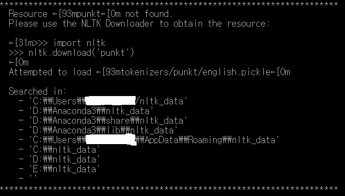
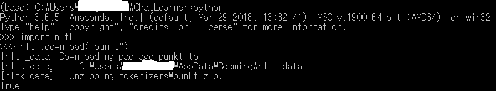
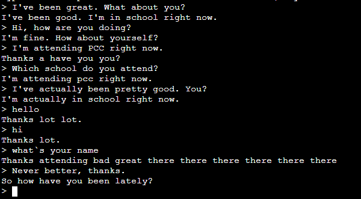

# ChatLearner

original source :  https://github.com/bshao001/ChatLearner
## Foundation work
python 3.5이상 버전 기준으로 만들어진 코드입니다. 넘파이와 텐서플로우 1.4버전 이상이 필요하며 기초적인 nlp 처리를 위해 NLTK 버전 3.2.4(3.2.5)가 필요합니다. 본 코드는 학습파일 전처리 - 단어 사전 형성 - 학습 - 실행 4 단계로 이뤄지고 있습니다. 
본 코드를 실행하기 위해서는 NLTK의 "punkt"가 설치돼야 합니다.
```bash
python
import nltk
nltk.download("punkt")
```



nltk punkt 미설치 시 나오는 에러


nltk punkt 설치 방법

## Preprocessing/Training/Test
텍스트 파일 전처리 작업은 preprocesser.py 파일로 작동됩니다. preprocesser.py 파일을 통해 전처리를 하기 위해서는 Data/HCI/Origin 경로내에 학습하려는 원본 파일을 저장해 놓아야 합니다. 프로그램 실행 시 Data/HCI/Augment0/ 디렉토리에 xxx_new.txt로 만들어 집니다.

```bash
python preprocesser.py
```

두번째 단계로 학습을 위한 단어 사전을 만들어야 합니다. 본 프로세스는 HCIvocabgenerator.py를 통해 실행 할 수 있으며 실행 결과 Data/HCI/ 디렉토리에 kovocab.txt 파일이 생성 됩니다.

```bash
python HCIvocabgenerator.py
```

위 두 전처리 단계가 완료되었다면 HCItrainer.py 를 실행 해 학습을 진행합니다. 학습을 위한 세부 파라미터 조정은 Data/HCI의 hparams.json을 수정하여 가능합니다. 본 json 파일에서 수정하길 권장하는 항목은 "batch_size", "num_epochs" 입니다. "batch_size"는 학습 시의 배치 사이즈를 결정하며, "num_epochs"는 학습의 횟수를 결정합니다. 제공되는 본 소스는 초기 epoch를 120으로 설정하였습니다. 학습 시 GPU 사용이 권장되며 데이터 셋의 크기에 따라 충분한 가용용량이 필요합니다. 제공된 데이터로 학습할 경우 약 100mb의 추가 공간이 필요합니다.학습한 가중치가 저장된 .ckpt 파일과 텐서보드 파일은 Data/HCI_Result 폴더에 저장됩니다.

```bash
python HCItrainer.py
```

학습한 결과 테스트는 HCIbotui.py 파일을 이용해 할 수 있으며 학습한 .ckpt 파일과 연동하기 위해 추가적인 변경이 필요합니다. 코드의 33번째 줄 BotPredictor의 변수 result_file의 기본값인 "hci"를 Data/HCI_Result에 저장되어 있는 ckpt 파일 이름 "hci-xxx" 로 변수를 변경하거나, 학습된 .ckpt 파일들의 이름을 BotPredictor의 초기값인 "hci"로 변경해야 합니다. 아래 사진은 본 챗봇 프로그램을 실행한 예시입니다.

```bash
python HCIbotui.py
```



HCIbotui.py 파일 실행 후 커멘드 창에 "> " 메세지가 뜨기 전까지 대기해 주세요. 채팅은 사용자가 "그만" 혹은 "exit"라고 입력할 때까지 진행됩니다.
 
1. hci.data-00000-of-00001
2. hci.index
3. hci.meta


## References and Credits:
1. The new NMT model: https://github.com/tensorflow/nmt
2. Tornado Web Service: https://github.com/rancavil/tornado-webservices
3. Reddit data parser: https://github.com/pender/chatbot-rnn
